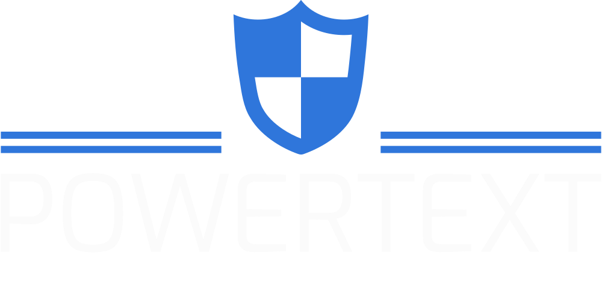

<!-- PROJECT LOGO -->

<div align="center">
  <a>
    
  </a>
    <br/>
    <br/>
  <h3 align="center">PowerText</h3>

  <p align="center">
    Automatic Content Modereation for Text in Social Media: Term of Service violations and AI content detection.
    <br />
    <a href=""><strong>View the Full Project Report »</strong></a>
    <br />
    <a href="https://edologgerbird-is4242-group8-analysis-systemhome-edoautom-esii7q.streamlit.app/"><strong>View the Demo Application for Content Regulators »</strong></a>
    <br />
    <a href=""><strong>View the Demo Application for Common Users » »</strong></a>
    <br />
  </p>
</div>

<!-- LEGAL DISCLAIMERS-->

This project was created using publicy available APIs and was created for educational reasons.
Contents of this project should ONLY be used for <strong>NON-COMMERICAL</strong> reasons.

<!-- TABLE OF CONTENTS -->

### Table of Contents

<ol>
<li><a href="#authors">Authors</a></li>
<li><a href="#codes-and-resources-used">Codes and Resources Used</a></li>
<li><a href="#data-ingestion-sources">Data Ingestion Sources</a></li>
<li><a href="#getting-started">Getting Started</a></li>
<li><a href="#usage">Usage</a></li>
<li><a href="#contact">Contact</a></li>
<li><a href="#acknowledgements">Acknowledgements</a></li>
</ol>

<br />

# PowerText Implementation

Our proposed system is specifically designed to accurately identify and flag content that violates terms of service in various categories such as hate speech, cyberbullying, and spam, while also being capable of distinguishing between human-generated and AI-generated content. 

### _Solution Architecture:_

  <a>
    
  </a>

### _Keywords:_

_Data Pipeline, Sentiment Analysis, Transformers, Roberta BERT, hateBERT, CNN, LSTM, Hugging Face, Natural Language Processing, TOS Violation Analysis, Web Scraping, Data Visualisation_

## Authors:

- Bikramjit Dasgupta 
- Lee Leonard
- Lin Yongqian
- Loh Hong Tak Edmund
- Tang Hanyang
- Tay Zhi Sheng
- Wong Deshun


<p align="right">(<a href="#top">back to top</a>)</p>

## Codes and Resources Used

**Python Version:** 3.9.10

**Built with:** [Microsoft Visual Studio Code](https://code.visualstudio.com/),
[Streamlit](https://streamlit.io/), [Git](https://git-scm.com/)

**Notable Packages:** praw, pandas, numpy, scikit-learn, xgboost, transformers, pytorch, torchvision, tqdm (view requirements.txt for full list)

<p align="right">(<a href="#top">back to top</a>)</p>

## Data Ingestion Sources

Our team extracted both structured and unstructred data from the following sources:

- [Reddit](https://www.reddit.com/) (via PRAW API endpoint)


<p align="right">(<a href="#top">back to top</a>)</p>

## Getting Started

### **Prerequisites**

Make sure you have installed all of the following on your development machine:

- Python 3.X.X

<p align="right">(<a href="#top">back to top</a>)</p>

## **Installation**

We recommend setting up a virtual environment to run this project.


### _1. Python Virtual Environment_

Installing and Creation of a Virtual Environment

```sh
pip install virtualenv
virtualenv <your_env_name>
source <your_env_name>/bin/active
```

The requirements.txt file contains Python libraries that your notebooks depend on, and they will be installed using:

```sh
pip install -r requirements.txt
```

We recommend using Google Colab to run the project (https://colab.research.google.com) as it gives free GPU access to run the model

<p align="right">(<a href="#top">back to top</a>)</p>
