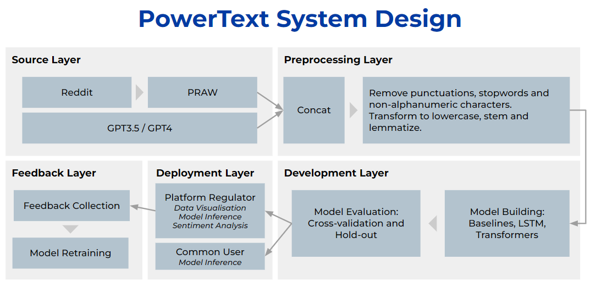

<!-- PROJECT LOGO -->

<div align="center">
  <a>
    
  </a>
  <h3 align="center">PowerText</h3>

  <p align="center">
    Automatic Content Modereation for Text in Social Media: Term of Service violations and AI content detection.
    <br />
    <a href=""><strong>View the Full Project Report »</strong></a>
    <br />
    <a href="https://edologgerbird-is4242-group8-analysis-systemhome-edoautom-esii7q.streamlit.app/"><strong>View the Demo Application for Content Regulators »</strong></a>
    <br />
    <a href=""><strong>View the Demo Application for Common Users » »</strong></a>
    <br />
  </p>
</div>

<!-- LEGAL DISCLAIMERS-->

This project was created using publicy available APIs and was created for educational reasons.
Contents of this project should ONLY be used for <strong>NON-COMMERICAL</strong> reasons.

<!-- TABLE OF CONTENTS -->

### Table of Contents

<ol>
<li><a href="#project-overview">Project Overview</a></li>
<li><a href="#authors">Authors</a></li>
<li><a href="#codes-and-resources-used">Codes and Resources Used</a></li>
<li><a href="#data-ingestion-sources">Data Ingestion Sources</a></li>
<li><a href="#getting-started">Getting Started</a></li>
<li><a href="#usage">Usage</a></li>
<li><a href="#contact">Contact</a></li>
<li><a href="#acknowledgements">Acknowledgements</a></li>
</ol>

<br />

# PowerText Implementation

## Project Overiview:

The objective of this project is to develop an automated content moderator for text content in social media platforms. Our proposed system is designed to accurately identify and flag content that violates terms of service in various categories such as hate speech, cyberbullying, and advertisements, while also being capable of distinguishing between human-generated and AI-generated content. To achieve this, we will leverage four commonly used Natural Language Processing (NLP) algorithms, namely NaiveBayes, PassiveAggressive, XGBoost, CNN, LSTM, GRU, and Transformers.

For our models, we will utilize a self-tagged dataset scrapped from Reddit posts (A global social media platform with diverse user-generated content), and a high-quality dataset of AI-generated content using GPT-3.5 and GPT-4. This combined dataset ensures comprehensive training on a variety of real-world posts, ensuring accuracy, effectiveness, and applicability across all the domains for social media.

The system offers two distinct end products: an automated content collection and screening service for social-media platforms, and a user side plug-in for post/comments check. Successful implementation will bring huge benefits to social media platforms, content creators and users, fostering a safe and healthy online environment.


### _Solution Architecture:_

  <a>
    
  </a>

### _Keywords:_

_Data Pipeline, Sentiment Analysis, Transformers, Roberta BERT, hateBERT, CNN, LSTM, Hugging Face, Natural Language Processing, TOS Violation Analysis, Web Scraping, Data Visualisation_

<p align="right">(<a href="#top">back to top</a>)</p>

## Authors:

- Bikramjit Dasgupta 
- Lee Leonard
- Lin Yongqian
- Loh Hong Tak Edmund
- Tang Hanyang
- Tay Zhi Sheng
- Wong Deshun


<p align="right">(<a href="#top">back to top</a>)</p>

## Codes and Resources Used

**Python Version:** 3.9.10

**Built with:** [Microsoft Visual Studio Code](https://code.visualstudio.com/), [Google Colab](https://colab.research.google.com/), [Streamlit](https://streamlit.io/), [Django](https://www.djangoproject.com/), [Git](https://git-scm.com/)

**Notable Packages:** praw, pandas, numpy, scikit-learn, xgboost, transformers, pytorch, torchvision, tqdm (view requirements.txt for full list)

<p align="right">(<a href="#top">back to top</a>)</p>

## Getting Started

### **Prerequisites**

Make sure you have installed all of the following on your development machine:

- Python 3.8.0 or above

<p align="right">(<a href="#top">back to top</a>)</p>

## **Installation**

We recommend setting up a virtual environment to run this project.


### _1. Python Virtual Environment_

Installing and Creation of a Virtual Environment

```sh
pip install virtualenv
virtualenv <your_env_name>
source <your_env_name>/bin/active
```

The requirements.txt file contains Python libraries that your notebooks depend on, and they will be installed using:

```sh
pip install -r requirements.txt
```

### _2. Google Colab Environment_

Our deep learning models were primarily trained on [Google Colab Pro](https://colab.research.google.com) due to the access to high performance GPUs required for the training of complex neural network systems. 

You can set up the Google Colab environment to run our model training codes by executing the following:

```py
from google.colab import drive
drive.mount('/content/drive')
content_path = "insert/path/to/your/data"
```
You will be prompted to log in with your Google Account. Simply replace the content_path with the path to directory where you have uploaded the data.

Alternatively, if you do not wish to authenticate with your Google Account, you may simply run the following code to retrieve the data from a permanent link:

```py
train_path = 'https://drive.google.com/uc?export=download&id=1ZTfYOXeZLW57mLR7IegIFovi7FW1chS6'
val_path = 'https://drive.google.com/uc?export=download&id=1ZMJI7DyKMLHpHp-HBUO64kWbP6A-qj9k'

train_df = pd.read_csv(train_path)
val_df = pd.read_csv(val_path)
```

The required additional modules required for each ```.ipynb``` notebook runned on Google Colab have been included in each notebook to be installed using ```pip```.

<p align="right">(<a href="#top">back to top</a>)</p>

## Code Structure

> INSERT CODE STRUCTURE

## Source Layer

### Data Ingestion Sources

Our team extracted both structured and unstructred data from the following sources:

| Source | Description | Size |
| ----------- | ----------- | ----------- |
| [Reddit](https://www.reddit.com/) | Extracted using the [PRAW API](https://praw.readthedocs.io/en/stable/) endpoint | 16828 |
| [ChatGPT](https://chat.openai.com/chat) | Generated using ChatGPT 3.5 and 4 | 6043 |
| Confounding Dataset | Manually created to include confounding and additional hate & ads | 26676 |

### Reddit Scraper Agent

The Reddit scraper agent can be location in ``` WebScrapper/reddit_scrapper.py```

This script defines methods that scrapes posts and comments based on user-specified subreddits, post counts and comment counts.

To initiate a ```reddit_scraper``` instance, execute the following Python code:

```py
from reddit_scaper import reddit_scrapper

reddit_agent = praw.Reddit(client_id='my_client_id', client_secret='my_client_secret', user_agent='my_user_agent')
reddit_scrapper(reddit_agent, ['MachineLearning', 'learnmachinelearning', 'GPT'], limit=10, comment_limit=10, topic="machinemind")
```

> 🔍To generate and specify the client_id, client_secret and user_agent, please follow the steps detailed [here](https://www.geeksforgeeks.org/how-to-get-client_id-and-client_secret-for-python-reddit-api-registration/)

### Storing of Raw Data

Our scraped data are compiled as xlsx and csv files, and stored within the ```Dataset/``` folder, categorised into
- Reddit Content: ```Dataset/Reddit Tagged Content``` 
- AI Content: ```Dataset/AI Content``` 
- Confounding Content: ```Dataset/Additional Data``` 

<p align="right">(<a href="#top">back to top</a>)</p>

## Data Processing Layer

### Data Preprocessing Notebook

Following the compilation of data from the multiple sources as detailed in the previous section, we proceeded to process the data to prepare it for model training and exploratory data analysis.

The preprocessing pipeline consist of the following steps:

_Data Concatenation_

1. Concatenating all datasets into a single ```DataFrame```.
2. Setting up target columns for each data entry 

_Text Preprocessing_

1. Remove Punctuations
2. Convert to lowercase
3. Remove non-alphanumeric characters
4. Remove stopwords
5. Remove extra spaces, new lines, tabs
6. Lemmetize and Stem text
7. Remove words with length < 2

To run the Data Preprocessing step, simply run the ```text_preprocessing.ipynb``` notebook in ```data_processing/``` folder.

### Exploratory Data Analysis

With the processed data, we conducted a comprehensive Exploratory Data Analysis of the combined dataset. The analyses undertaken include:

1. Class distribution
2. N-gram analysis
3. Cluster analysis (Document and word)
4. Polarity analysis
5. Perplexity analysis
6. Burstiness analysis

To view the Data Preprocessing step, simply run the ```data_eda.ipynb``` notebook in ```data_processing/``` folder.

> ⚠️ Do remember to adjust the paths to where you store your dataset on your local machine!

## Development Layer

We proceed to build and train a suite of models to predict potential TOS violations within the text input. The following models were built, trained and evaluated:

### _Baseline Models_ 
1. Multinomial NaiveBayes Classifier
2. PassiveAggressive Classifier
3. XGBoost Classifier

The baseline models training notebook can be found at ```model_building/baselines/baseline_models.ipynb```.

### _Deep Learning Models_
1. Convolutional Neural Network (CNN) 
2. Gated Recurrent Unit
3. Long Short-term Memory 
4. Basic Transformer 
5. Bidirectional Encoder Representations from Transformers (BERT) 
6. RoBERTa 
7. hateBERT (multiple varients)  

The respective deep learning models training notebooks can be found at ```model_building/xxx/xxx.ipynb```.


| Model | Precision | Recall | F1 | 
| ----------- | ----------- | ----------- | ----------- |
| Multinomial Naive Bayes |  0.27 | 0.17 | 0.20 |
| PassiveAggressive       |  0.67 | 0.55 | 0.60 |
| XGBoost                 |  0.79 | 0.42 | 0.53 |
| CNN                     |  0.33 | 0.31 | 0.32 |
| GRU                     |  0.33 | 0.34 | 0.33 |
| LSTM                    |  0.32 | 0.32 | 0.32 |
| Basic Transformer       |  0.68 | 0.52 | 0.55 |
| BERT                    |  0.85 | 0.65 | 0.70 |
| RoBERTa                 |  0.80 | 0.63 | 0.68 |
| hateBERT variant 1      |  0.79 | **0.79** | 0.79 |
| hateBERT variant 2      |  **0.89** | 0.77 | **0.82** |
| hateBERT variant 3      |  0.81 | 0.69 | 0.72 |

From initial testing, we observed that hateBERT performs the best for our task and given dataset. To increase robustness in evaluation, we further conducted a 10-fold Cross Validation on individual targets for the hateBERT model using variant 2. 

| Model | Precision | Recall | F1 | n |
| ----------- | ----------- | ----------- | ----------- | ----------- |
| Hate Speech |  0.94 | 0.95 | 0.94 | 1958 |
| Privacy | 0.66 | 0.73 | 0.69 | 26 |
| Sexual | 0.67 | 0.57 | 0.61 | 46 |
| Impersonation  | 0.60 | 0.46 | 0.52 | 26 |
| Illegal | 0.50 | 0.57 | 0.53 | 28 |
| Advertisement | 0.78 | 0.83 |0.80 | 47 |
| AI Content | 0.98 | 0.98 | 0.98 | 684 |
| Neutral | 0.94 | 0.93 | 0.94 | 2175 |

The model weights of the hateBert has been saved for future deployment. It is stored at ```analysis_system/models/model_weights_bert1.pth```

## Deployment Layer

### Product 1: Automatic Post Analysis Dashboard for Content Moderators

The first product was built using [Streamlit](https://streamlit.io/), an open-source framework that allows developers to rapidly develop web applications for data science purposes. 

To run the Automatic Post Analysis Dashboard, execute the following code in the CLI:

```sh
streamlit run analysis_system/Home.py
```
> ⚠️ Ensure that you have the Streamlit package installed! Do install the requirements via the requirements.txt if you have not done so!

The application should run on ```http://localhost:8501/```.

Alternatively, you may access the deployed version [here](https://edologgerbird-is4242-group8-analysis-systemhome-edoautom-esii7q.streamlit.app/).

### Product 2: Text Classification for Common Users

The second product was built using [Django](https://www.djangoproject.com/), another framework that enables developers to build web apps rapidly.

To run the Text Classification for Commun Users application, execute the following code in the CLI:

```sh
python Platform/manage.py runserver
```
> ⚠️ Ensure that you have Django installed! Do install the requirements via the requirements.txt if you have not done so!


## Feedback Layer

In this last layer, we intend to collect feedback from content moderators regarding the predicted target violations for each Reddit post. The feedback is collected via the ```Automatic Post Analysis Dashboard for Content Moderators```.

The feedback is collected and saved into a csv file located at: ```analysis_system/data_store/feedback/feedback.csv```.

This feedback will be incorporated into the next model retraining cycle.


